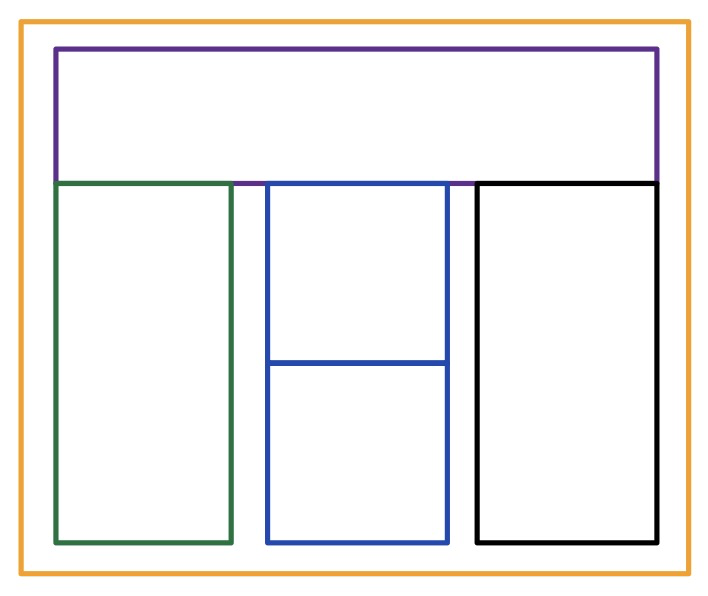

# Activity 1: Create the Following Layout

- Create a layout with a **container** having:
  - Height: **1000px**
  - Width: **1200px**
  

- Use appropriate CSS to match the layout shown.
- Arrange all boxes so that the overall structure matches the illustrated design.

